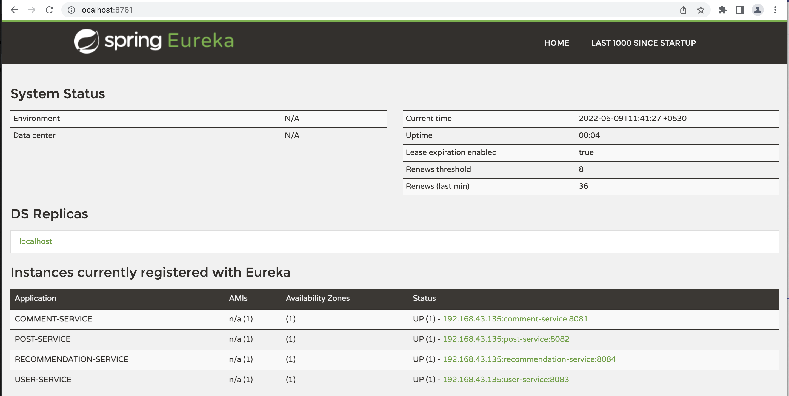
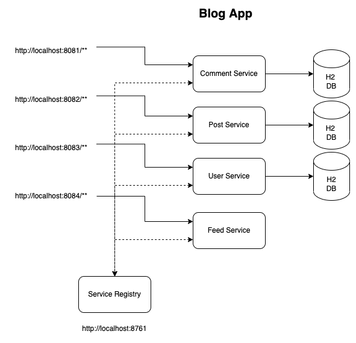

# Blog Application (Microservices)

### End Points

#### User Service
> http://localhost:8083/users

#### Post Service
> http://localhost:8082/posts

#### Comment Service
> http://localhost:8081/comments

#### Recommendation Service
> http://localhost:8084/feed

#### Eureka Server
> http://localhost:8761/

### Swagger UI

> http://localhost:port_number/swagger-ui.html

### Swagger API Docs

> http://localhost:port_number/v2/api-docs

### Actuators

> http://localhost:port_number/actuator/info, http://localhost:port_number/actuator/health etc..

## Architecture Diagram

## ER Diagram

### References
* https://microservices.io/
* https://www.baeldung.com/spring-boot-actuators
* https://www.baeldung.com/swagger-2-documentation-for-spring-rest-api
* https://www.baeldung.com/spring-cloud-openfeign
* https://www.baeldung.com/spring-cloud-netflix-eureka

### Other Repos

* https://github.com/Deloitte/DynamoDB-REST-APIs-Example.git
* https://github.com/Deloitte/Blog-App-Monolith.git
* https://github.com/Deloitte/Blog-App-Microservices.git
* https://github.com/Deloitte/Blog-App-Microservices-API-Gateway.git
* https://github.com/Deloitte/Blog-App-Microservices-Unit-Integration-Testing.git
